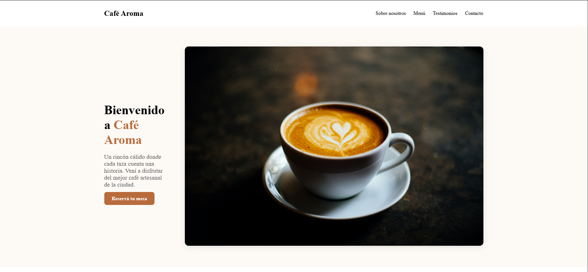

# ☕ Landing Page - Café Aroma

Landing page moderna y responsive para una cafetería, desarrollada con [Astro](https://astro.build/) y optimizada para buen rendimiento, accesibilidad y compatibilidad móvil.



---

## 🧰 Tecnologías utilizadas

- ⚡ Astro
- 💅 HTML, CSS, JavaScript
- 🌗 Modo oscuro automático (`prefers-color-scheme`)
- 📱 Diseño responsive con menú hamburguesa
- 📍 Google Maps embebido
- 💬 Botón de WhatsApp

---

## 🚀 Demo local

### 1. Clonar el repositorio

```bash
git clone https://github.com/tuusuario/landing-cafe-aroma.git
cd landing-cafe-aroma
```

### 2. Instalar dependencias

```bash
npm install
```

### 3. Iniciar servidor de desarrollo

```bash
npm run dev
```

Luego accedé a `http://localhost:4321` en tu navegador.

---

## 🗂 Estructura del proyecto

```
📁 src/
├── components/
│   └── Navbar.astro
├── pages/
│   └── index.astro
└── styles/
    └── global.css
```

---

## 📸 Capturas

> Agregá una imagen llamada `screenshot.png` en la raíz del proyecto para mostrar una preview de la landing en este archivo.

---

## 📄 Licencia

Este proyecto es de código abierto bajo licencia MIT. Podés usarlo, modificarlo y adaptarlo libremente.

---

## 🙋‍♂️ Autor

Desarrollado por [Tu Nombre](https://github.com/tuusuario) — Freelancer frontend 🇦🇷
